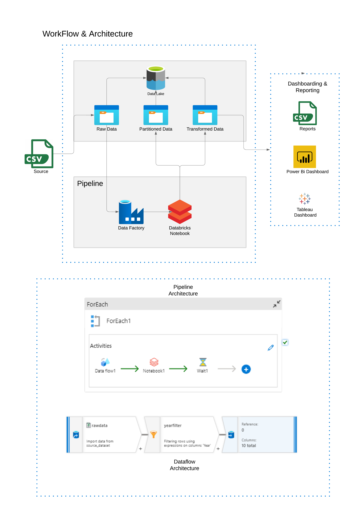

# Olympics Data Analysis Project

## Table of Contents

- [Overview](#overview)
- [Project Structure](#project-structure)
- [Prerequisites](#prerequisites)
- [Azure Data Factory Pipeline](#azure-data-factory-pipeline)
  - [Data Ingestion](#data-ingestion)
  - [ForEach Activity](#foreach-activity)
  - [Data Transformation (Jupyter Notebook)](#data-transformation-jupyter-notebook)
  - [Output Generation](#output-generation)
  - [Real-time Power BI Dashboard](#real-time-power-bi-dashboard)
  - [Waiting Period](#waiting-period)
- [Data History and Scope](#data-history-and-scope)

## Overview

The Olympics Data Analysis Project is a comprehensive data processing and analysis pipeline designed to analyze and transform Olympic Games data. Leveraging Azure Data Factory, Apache Spark, PySpark, and Power BI, this project covers nearly 124 years of Olympic history across 29 Olympic Games, with close to 300,000 rows of data. The goal is to provide real-time insights into Olympic data, enabling dynamic reporting and analysis.

## Project Structure

The project structure is organized as follows:

- `data/`: Raw CSV data files for Olympic Games data are stored here.

- `notebooks/`: This directory contains Jupyter notebooks, including `olympics_transformation_adv.ipynb`, which is used for data transformation.

- `scripts/`: Python scripts related to data processing are located here.

- `requirements.txt`: A list of project dependencies for easy installation.

- `README.md`: This document provides an in-depth overview of the project and instructions for setup and usage.

## Prerequisites

Before setting up and running the project, ensure you have the following prerequisites in place:

- Python
- PySpark
- XlsxWriter
- Azure Data Factory (for pipeline execution)
- Power BI (for real-time dashboard)

 Explore the project components, including notebooks in the `notebooks/` folder and scripts in the `scripts/` folder.

## Azure Data Factory Pipeline

The core of this project is the Azure Data Factory (ADF) pipeline, which orchestrates the data processing workflow. Here's a detailed breakdown of how it works:

### Data Ingestion

- Raw Olympic Games data in CSV format is stored in the `data/` folder.

### ForEach Activity

- The ADF pipeline is parameterized with an array containing years of Olympic Games.

- Inside the pipeline, a ForEach activity iterates over each year in the array.

### Data Transformation (Jupyter Notebook)

- For each year, the `olympics_transformation_adv.ipynb` Jupyter notebook is executed.

- PySpark is employed for in-depth data analysis, including medal counts, athlete performance, and more.

- Filtered and transformed data is generated for each year.

### Output Generation

- Filtered data is saved as CSV files in the `partitioned data` folder within Azure Data Lake Storage. File names follow the pattern `{year}_olympic_data.csv`.

- Transformed data is stored as Excel files in the `transformed data` folder within Azure Data Lake Storage. File names follow the pattern `{year}_olympics_reports.xlsx`.

### Real-time Power BI Dashboard

- A Power BI dashboard is connected to Azure Data Lake Storage's `transformed data` folder. It collects and refreshes data every 8 minutes, offering real-time Olympic reports.

### Waiting Period

- A wait activity in the ADF pipeline waits for 5 minutes to ensure data processing completion before proceeding to the next year.

## Data History and Scope

This project boasts an extensive dataset covering 124 years of Olympic history, encompassing 29 Olympic Games, and spanning approximately 300,000 rows. The rich historical data empowers in-depth analyses and insights into the world of Olympic sports.

